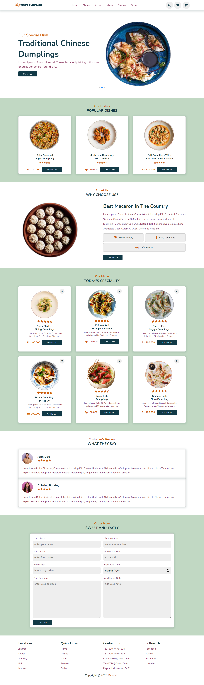

# Tina's-Dumpling-Responsive-Website

Tina's Dumpling Web combines HTML, CSS, and JavaScript to create a typical web page structure. HTML structures content, CSS styles it for different devices, and JavaScript adds interactivity. Responsive design ensures optimal display across screens. These technologies enable engaging and user-friendly websites.

